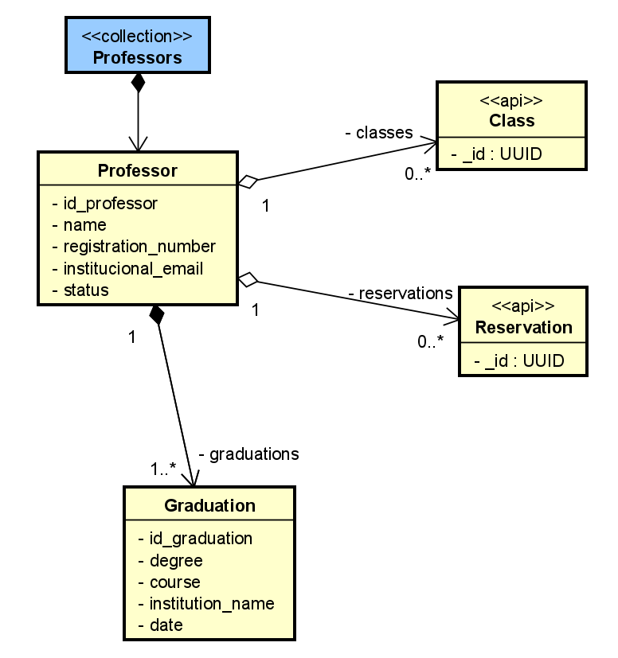
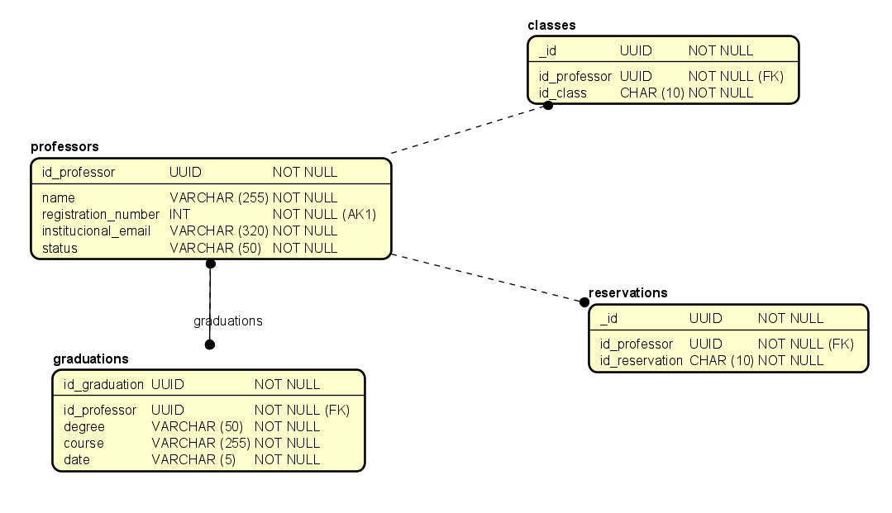

# 🎓 Microsserviço de Professores (Professors)


Este projeto consiste em um microsserviço para gerenciamento de Professores, suas Graduações e associações com Turmas (Classes), como parte da Avaliação Prática P2 da disciplina de Construção de Software.

A API implementa operações CRUD para a entidade principal (Professor) e para a entidade secundária aninhada (Graduação), além de endpoints para associação com turmas. Toda a API é protegida e integrada ao Keycloak para autenticação e autorização, conforme especificado no `docker-compose.yml` principal do projeto.

## 🚀 Tecnologias Utilizadas

* **Linguagem:** Python 3.10
* **Framework API:** FastAPI
* **Banco de Dados:** PostgreSQL 15
* **ORM:** SQLAlchemy (com suporte a `asyncio`)
* **Autenticação:** Keycloak (via microsserviço OAuth)
* **Containerização:** Docker & Docker Compose
* **Gerenciamento de Dependências:** Poetry

## 🏗️ Arquitetura de Software: Hexagonal (Portas e Adaptadores)

Conforme solicitado no enunciado, esta seção oferece esclarecimentos sobre a arquitetura de software adotada.

O microsserviço foi estruturado seguindo os princípios da **Arquitetura Hexagonal (Ports and Adapters)**. O objetivo principal é isolar a lógica de negócio (o "Core") de detalhes de infraestrutura (como o framework da API, o banco de dados ou serviços externos).

Isso é alcançado através da inversão de dependências: o *Core* define interfaces (as **Portas**) que ele espera que o mundo exterior implemente, e a lógica de negócio é escrita exclusivamente em termos dessas interfaces, sem conhecer detalhes de implementação.

A estrutura de diretórios do projeto `professors` reflete essa separação:

### 1. 🟣 Core (O Hexágono)

O "Core" (`professors/core`) contém a lógica pura da aplicação, sem dependências de infraestrutura.

* **`core/domain`**: Define os modelos de dados puros da aplicação (ex: `Professor`, `GraduationCreate`). São as entidades centrais do negócio.
* **`core/ports`**: Define as **Portas**. São interfaces (classes base abstratas) que descrevem o que a aplicação *precisa* (ex: `ProfessorRepositoryPort`, `GraduationRepositoryPort`). Elas ditam: "Eu preciso de um lugar para salvar um professor" ou "Eu preciso buscar um professor pelo ID", mas não dizem *como* (SQL, NoSQL, etc.).
* **`core/services`**: Contém a lógica de negócio e orquestração (ex: `ProfessorService`). Os serviços são os únicos que conhecem e utilizam as `ports` para realizar seu trabalho. Eles são o ponto de entrada para o Core.

### 2. 🔌 Adaptadores (Os "Plugs")

Os "Adaptadores" (`professors/adapters`) são as implementações concretas das portas, conectando o Core ao mundo exterior.

* **`adapters/api` (Driving Adapter)**: Este adaptador "dirige" a aplicação. As rotas do FastAPI (ex: `routes/professors.py`) recebem requisições HTTP, validam os dados (usando `schemas`) e chamam os métodos do `core/services`. O `adapters/api/auth.py` também atua como um adaptador, protegendo as rotas.
* **`adapters/database` (Driven Adapter)**: Este adaptador é "dirigido" pela aplicação. Ele implementa as interfaces definidas em `core/ports`. Por exemplo, `database/professor_repository.py` contém a classe `ProfessorRepository` que implementa a `ProfessorRepositoryPort`, traduzindo as chamadas de serviço (como `service.create_professor`) em operações concretas do SQLAlchemy contra o PostgreSQL.

### 3. 🔩 Injeção de Dependência (A "Cola")

O arquivo `professors/dependencies.py` é a cola que une a arquitetura. Ele usa o sistema de Injeção de Dependência do FastAPI (`Depends`) para conectar as **Portas** (interfaces) aos **Adaptadores** (implementações) em tempo de execução.

Quando um `service` no Core pede por uma `ProfessorRepositoryPort`, o FastAPI injeta uma instância concreta do `ProfessorRepository` (o adaptador de banco de dados).

Isso torna a aplicação altamente modular, testável (podemos "mockar" os repositórios facilmente) e flexível (poderíamos trocar o PostgreSQL por outro banco apenas criando um novo adaptador, sem tocar em `core/services`).

## 🗃️ Diagrama de Dados

Os diagramas abaixo representam os modelos conceitual e lógico-relacional utilizados para a persistência dos dados no PostgreSQL, conforme os artefatos visuais fornecidos.

### Modelo Conceitual



### Modelo Lógico Relacional (ER)



## 🏁 Execução do Projeto

Este serviço é um submódulo e é orquestrado pelo arquivo `docker-compose.yml` na raiz do projeto principal.

### 1. Pré-requisitos

* [Docker](https://www.docker.com/get-started)
* [Docker Compose](https://docs.docker.com/compose/install/)
* Um arquivo `.env` configurado na raiz do projeto principal (no mesmo nível do `docker-compose.yml`).

### 2. Variáveis de Ambiente

O `docker-compose.yml` principal utiliza variáveis do arquivo `.env` para configurar este serviço. As variáveis esperadas são:

```yml
# Configurações do Banco de Dados do Serviço
PROFESSORS_POSTGRESQL_DB=professors
PROFESSORS_POSTGRESQL_USERNAME=professors
PROFESSORS_POSTGRESQL_PASSWORD=a12345678

# Configurações de Porta do Serviço
PROFESSORS_INTERNAL_API_PORT=8080
PROFESSORS_EXTERNAL_API_PORT=8181

# ... (outras variáveis de banco de dados, Keycloak, etc., conforme o .env base)
```

### 3. Execução

Com o arquivo `.env` configurado, execute o seguinte comando na **raiz do projeto principal**:

```bash
docker compose up --build
```

Este comando irá:
1.  Construir (ou reconstruir) as imagens Docker para todos os serviços, incluindo `professors`.
2.  Iniciar todos os containers (Keycloak, PostgreSQL, OAuth, Professors, etc.) em uma rede interna.
3.  O serviço `professors` (definido no `docker-compose.yml`) aguardará o `postgresql` e o `oauth` estarem saudáveis (`service_healthy`) antes de iniciar.
4.  Expor a API de Professores na porta definida por `PROFESSORS_EXTERNAL_API_PORT` (neste caso, `http://localhost:8181`).

## 📚 Documentação da API (Swagger)

A documentação interativa da API (Swagger UI), requisito do enunciado, é gerada automaticamente pelo FastAPI e fica disponível no endpoint `/docs` após a inicialização do serviço.

* **URL da Documentação Swagger:** **[http://localhost:8181/docs](http://localhost:8181/docs)**

### Resumo dos Endpoints Implementados

A API implementa os endpoints solicitados para as coleções principal (Professores) e secundária (Graduações), todos protegidos por autenticação (`validate_token`).

*(Nota: Os requisitos de `PATCH` e query complexa (`{op}{valor}`) do enunciado não foram implementados nos arquivos de rota fornecidos, portanto não estão listados abaixo.)*

#### 👨‍🏫 Coleção Principal: Professores
*Prefixo: `/api/v1/professors`*

| Método | Endpoint | Resumo | Req. Enunciado |
| :--- | :--- | :--- | :--- |
| `POST` | `/` | Criar um novo professor. | `POST /{api}` |
| `GET` | `/` | Listar professores (filtro simples: `?name=...&status=...`). | `GET /{api}` e `GET /{api}?{query}` |
| `GET` | `/{id}` | Buscar um professor específico pelo ID. | `GET /{api}/{id}` |
| `PUT` | `/{id}` | Atualizar totalmente um professor pelo ID. | `PUT /{api}/{id}` |
| `DELETE` | `/{id}` | Deletar um professor pelo ID. | `DELETE /{api}/{id}` |

#### 🎓 Coleção Secundária: Graduações
*Prefixo: `/api/v1/professors/{professor_id}/graduations`*

| Método | Endpoint | Resumo | Req. Enunciado |
| :--- | :--- | :--- | :--- |
| `POST` | `/` | Criar uma nova graduação para um professor. | `POST /{api}/{id}/{collection}` |
| `GET` | `/` | Listar todas as graduações de um professor. | `GET /{api}/{id}/{collection}` |
| `PUT` | `/{graduation_id}` | Atualizar uma graduação específica. | `PUT /{api}/{id}/{collection}/{id}` |
| `DELETE` | `/{graduation_id}` | Deletar uma graduação específica. | `DELETE /{api}/{id}/{collection}/{id}` |
| `GET` | `/api/v1/graduations/` | (Extra) Listar todas as graduações do sistema. | N/A |

#### 📖 Entidade Associada: Turmas (Classes)
*Prefixo: `/api/v1/professors/{id}/classes`*

| Método | Endpoint | Resumo |
| :--- | :--- | :--- |
| `POST` | `/` | Associar um professor a uma turma. |
| `GET` | `/` | Listar as turmas associadas a um professor. |
| `DELETE` | `/{class_id}` | Desassociar um professor de uma turma. |